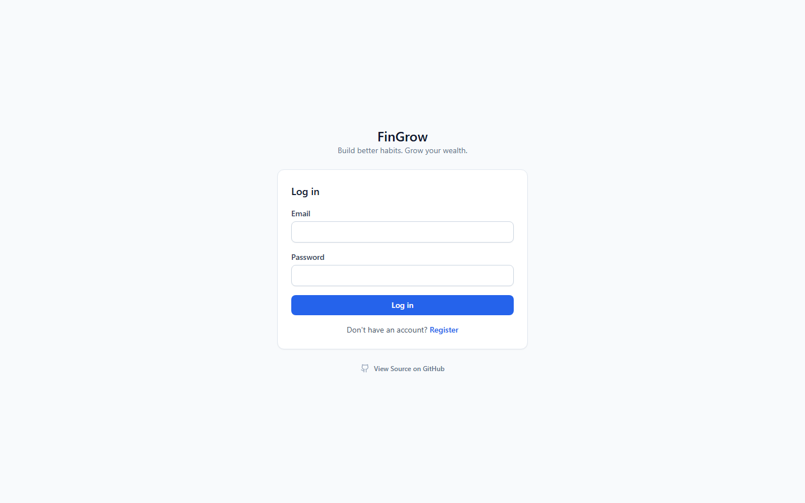
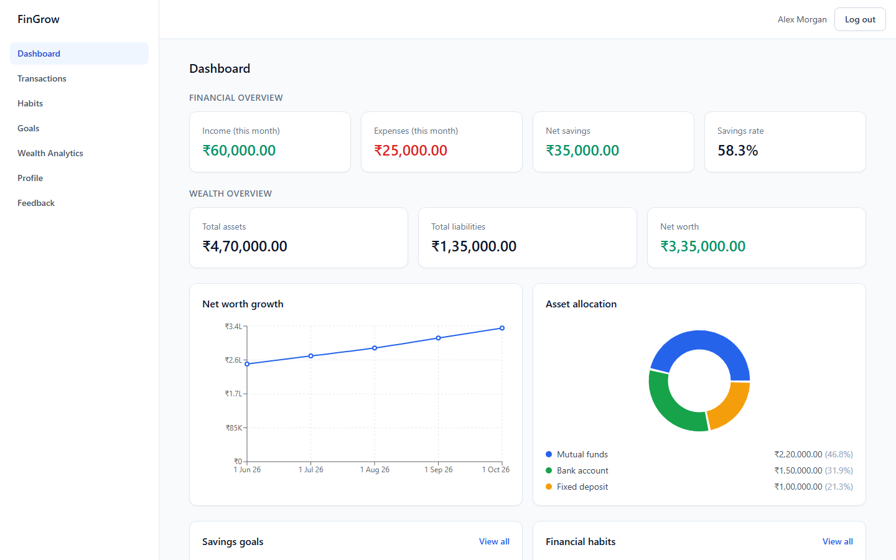
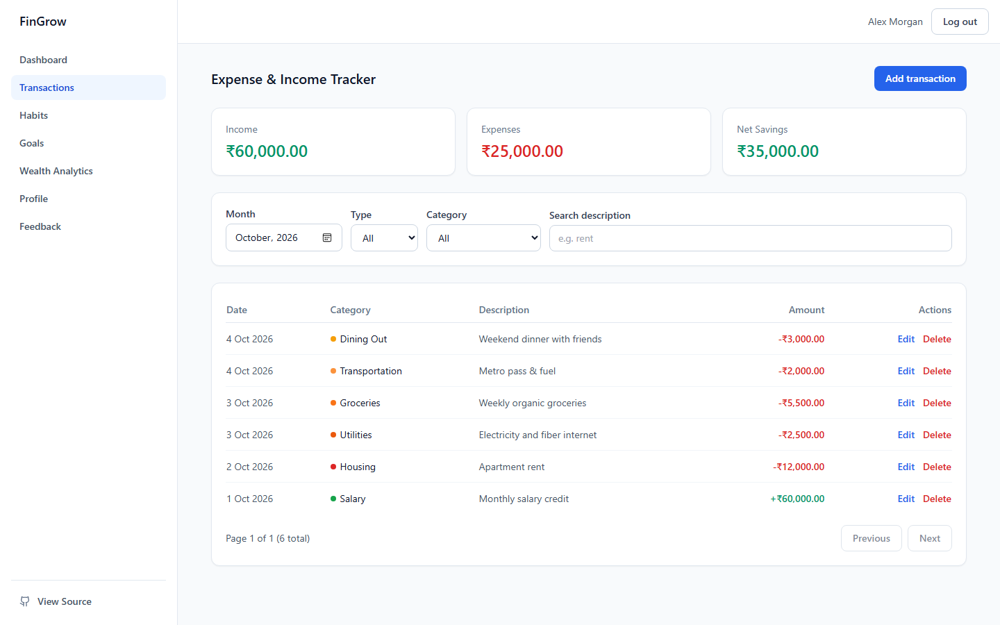
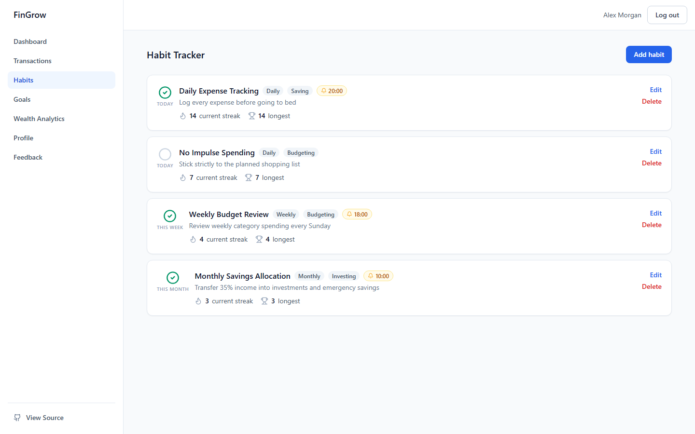
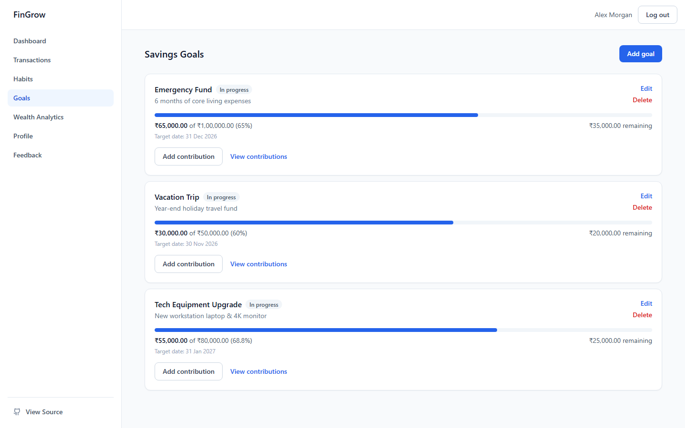
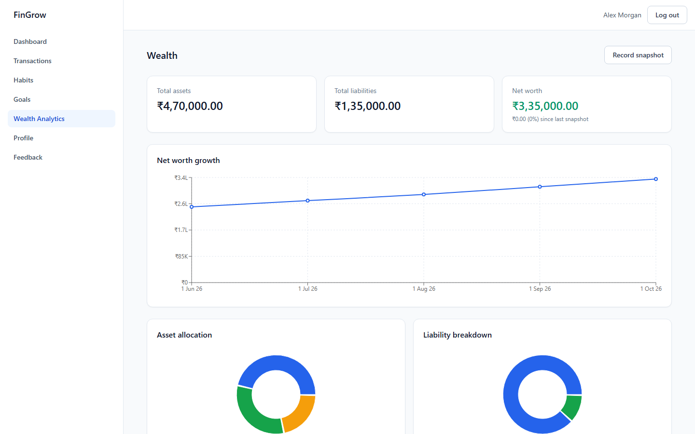
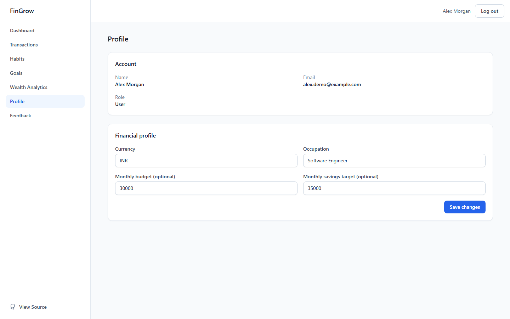
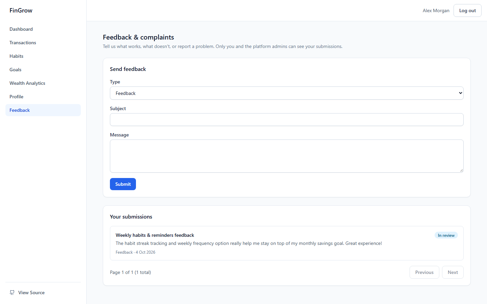
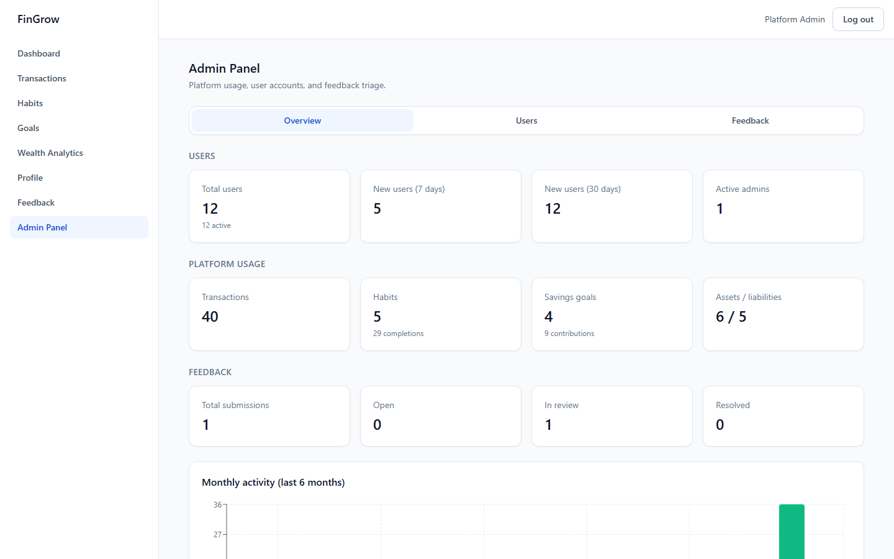

# FinGrow Screenshots

A visual walkthrough of the FinGrow application interface, illustrating core flows across authentication, cash flow tracking, habit building, dedicated savings targets, balance sheet wealth management, user settings, and administrator oversight. All views are captured at a desktop viewport of 1440 × 900.

---

## Authentication

*Figure 1: Authentication and sign-in interface.*

The authentication screen provides secure user access with email and password inputs, error validation, and quick navigation to registration or source repository inspection.

---

## Dashboard

*Figure 2: Centralized executive financial dashboard.*

The dashboard unifies high-level financial metrics, monthly cash flow summaries, net worth trajectory trends, and asset distribution breakdowns into a single responsive view.

---

## Financial Tracking

*Figure 3: Income and expense transaction management.*

The transactions view enables logging, filtering by month and category, search, and pagination across categorized income and expense cash flow records.

---

## Financial Habits

*Figure 4: Financial habits tracking with streak mechanics and reminders.*

The habits screen demonstrates daily, weekly, and monthly discipline tracking with consecutive streak counters, one-click completion check-ins, and scheduled in-app reminder indicators.

---

## Savings Goals

*Figure 5: Earmarked savings goals with visual progress bars.*

The savings goals view displays earmarked financial targets with percentage completion bars, deadline dates, and incremental contribution histories.

---

## Wealth

*Figure 6: Balance sheet registers and net worth analytics.*

The wealth dashboard tracks manual asset and liability balances, calculates real-time net worth, and visualizes historical growth alongside portfolio allocation breakdowns.

---

## User Profile

*Figure 7: User account and financial preference settings.*

The profile screen allows users to manage personal details, preferred currency symbols, occupation, and monthly budget and savings targets.

---

## Feedback

*Figure 8: In-app user feedback submission and status tracking.*

The feedback interface provides a structured channel for users to submit feedback or complaints and track resolution status in real time.

---

## Administration

*Figure 9: Administrator operations, system health, and feedback triage.*

The admin panel provides platform-wide usage metrics, active user account governance, and centralized triage for submitted user feedback.
